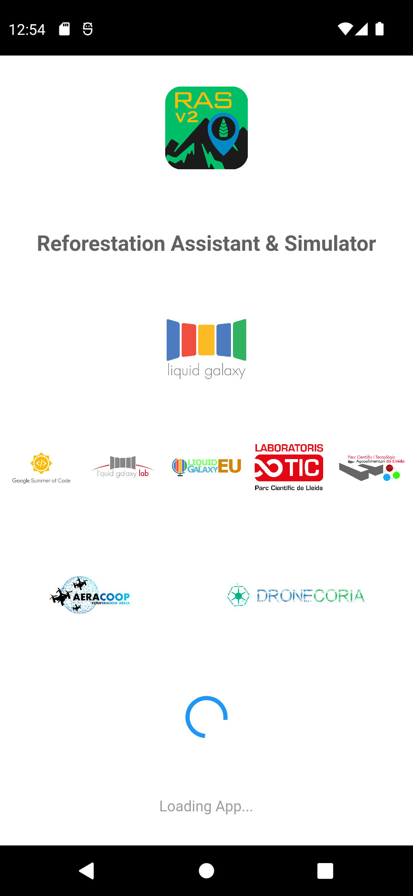
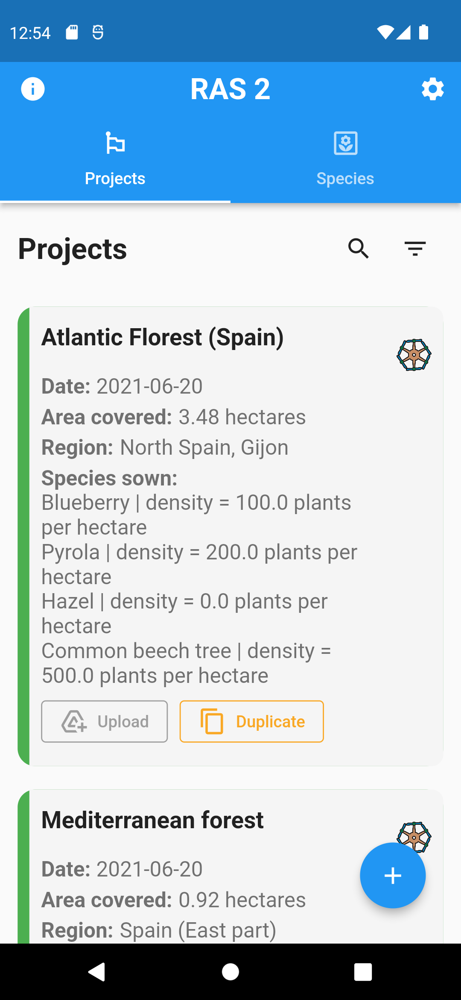
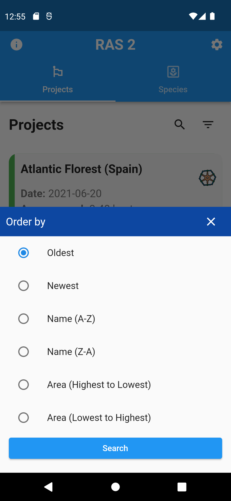
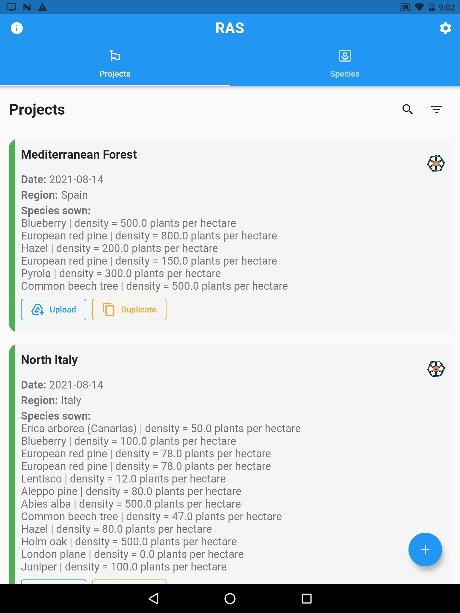
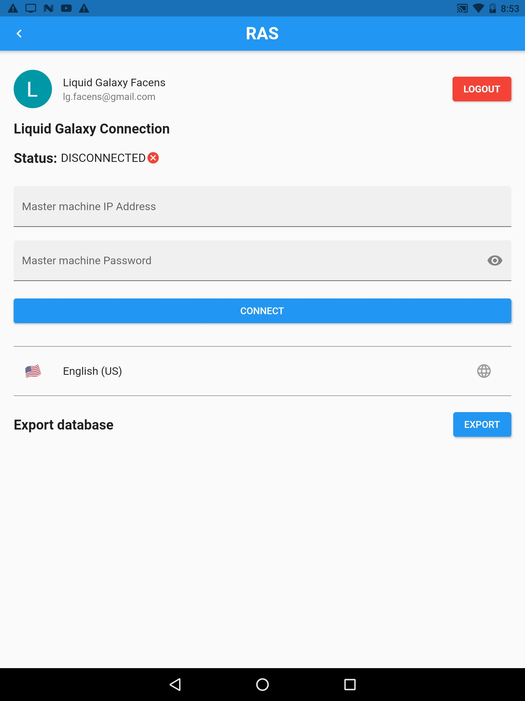
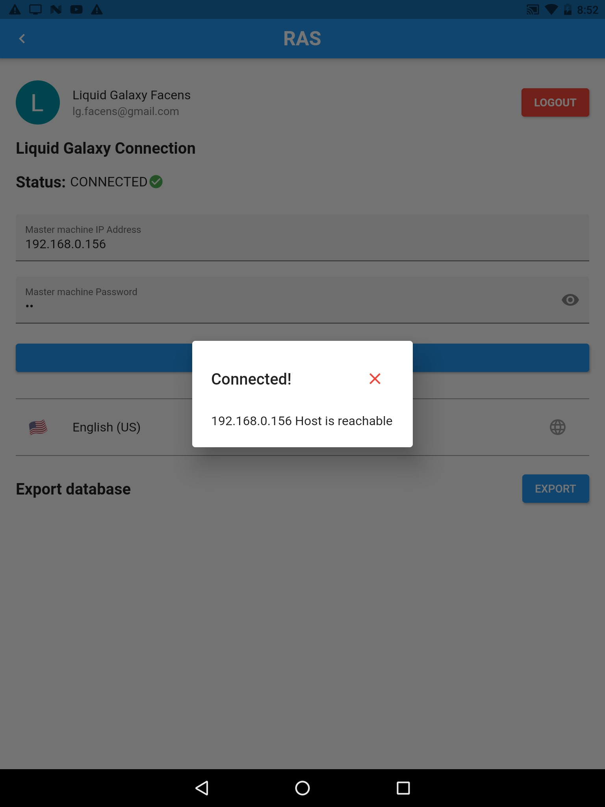
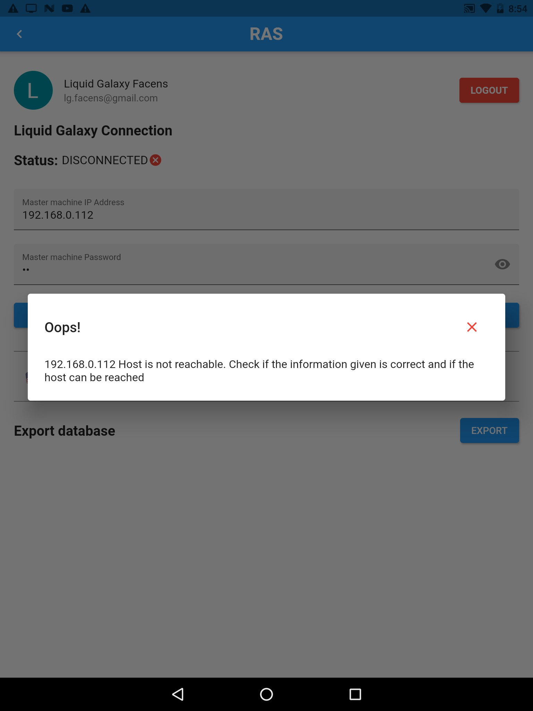

[](https://opensource.org/licenses/Apache-2.0) []() []() [](https://github.com/LiquidGalaxyLAB/reforestation-assistant/issues) []() []()

# Reforestation Assistant & Simulator

The Reforestation Assistant & Simulator idea is to create an app to help on reforestation of degraded areas of the planet by drone or manually. The project will consist of an Android App where users can plan the reforesting missions, by defining areas of seeding, specific seed/tree location, drone landing points, fly zones and other helpful metrics. All the gathered information will be dynamically displayed on the Liquid Galaxy cluster using KMLs and also on the app with the help of graphics and text to bring users a great and immersive overview of the mission panorama.

This is being started as a Google Summer of Code 2021 project and has been continued in Google Summer of Code 2022 with the Liquid Galaxy Organization alongside the Dronecoria team.

### App Screenshots







## Running with APK

### Prerequisites

* Android device

### Step 1: Download apk

Download the apk file from [this repository](https://github.com/LiquidGalaxyLAB/reforestation-assistant-simulator/tree/main/resources) or the [shared drive folder](https://drive.google.com/drive/folders/16yQr1vyfkY4nVqhDR_kzpLMki1UTQzkL?usp=sharing) and save it to your device

### Step 2: Install

Click on the apk and follow the android instructions for installation.

### Step 3: Connect to Liquid Galaxy

1. On the home page, click on the gear icon to access the settings page



2. On settings, type the ip address and password of the LG master machine
3. Hit “CONNECT”
4. If it is connected correctly you will be prompted with a success message and with the status will change to **CONNECTED**.





**Obs.:** If prompted with the message of *Host is not reachable*, it means the LG master can't be accessed. So check out if you are in the same network of the Liquid Galaxt and that the master can be accessed via SSH.



## Running from source

### Prerequisites

* Android Studio, Visual Studio Code or another IDE that supports Flutter development
* Flutter SDK
* Android SDK
* Android device or emulator
* Git

Documentation on how to set up Flutter SDK and its environment can be found [here](https://flutter.dev/docs/get-started/install).

### Step 1: Clone the repository

The full code is located in this GitHub repository. To clone the project via terminal use:

```
git clone https://github.com/LiquidGalaxyLAB/reforestation-assistant.git
```

### Step 2: Set up Google Maps API Key

RAS uses [Google Maps Android API](https://developers.google.com/maps/documentation/android-sdk/overview?hl=pt-br) as the map service. To use Google Maps you required an **API KEY**. To get this key you need to:

1. Have a Google Account
2. Create a Google Cloud Project
3. Open Google Cloud Console
4. Enable Maps Android SDK
5. Generate an API KEY

With the key in hands, the next step is placing the key inside the app. Go to *android/app/main* and edit the **AndroidManifest.xml**.

Replace the **PLACE_HERE_YOUR_API_KEY** with the key you just created.

```
<application
        android:label="RAS"
        android:icon="@mipmap/ic_launcher">
        <meta-data android:name="com.google.android.geo.API_KEY"
            android:value="PLACE_HERE_YOUR_API_KEY"/>
        
```

### Step 3: Run the code

Open a terminal and navigate to the project root directory. First you need to install the packages by running:

```
flutter pub get
```

After successfully installing all the packages, make sure you have a device connected, either a real mobile phone or an emulator. You can run flutter doctor to check out the connected devices and if all the environment is correct.

```
flutter doctor
```

With everything ready to go, it is time to run the project. Since dart is moving up versions to offer null safety, some packages that are being used still haven’t migrated to the new null safety policies, so we need to run the project with the following command:

```
flutter run --no-sound-null-safety
```

### Step 4: Connect to Liquid Galaxy

If you followed all the steps till now you have your app up and running. The next step is to click on the gear icon, where the settings of the Liquid Galaxy and Google Drive are.

To connect with your Liquid Galaxy, type de IP Address, separating the numbers using dot and the password of the cluster. Hit connect so the ip and password will be saved on the device and you’ll be prompted if the connection could be established or not.

The next step is logging with a Google Account so all the information can be saved there. Hit the Connect to drive button and add your credentials. If everything went well you will be prompted.

There you go! You are now ready to enjoy the app and make the modifications you want.

The app comes with some mock data to serve as demonstration, so you can start exploring different types of reforestation projects and seeds.

## Contributing 

Fill up issues, bugs or feature requests in our issue tracker. Please be very descriptive and clear so it is easier to help you.

If you want to contribute to this project you can open a pull request at time you like. 

## License

This software is under the [MIT License](https://en.wikipedia.org/wiki/MIT_License)


Copyright 2021 [Karine Aparecida Pistili Rodrigues](https://www.linkedin.com/in/karine-pistili)
